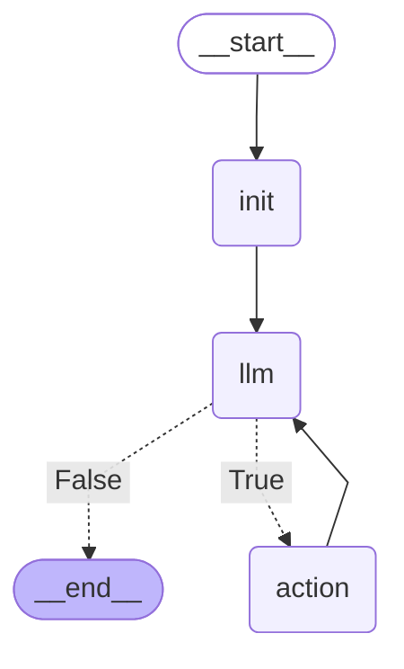

# Wise Guy

Agente inteligente de investigación en la web construido con LangGraph, usando modelos de OpenAI y la herramienta de búsqueda de Tavily. El agente decide cuándo llamar al buscador y puede encadenar varias búsquedas para ofrecer una respuesta final sintetizada.

## ¿Qué hace?

- Recibe una pregunta del usuario.
- Llama a un modelo de chat de OpenAI con capacidades de tool-calling.
- Cuando el modelo lo considera necesario, invoca la herramienta `TavilySearch` para consultar la web.
- Puede realizar varias llamadas a herramientas y volver al modelo para razonar sobre los resultados.
- Devuelve una respuesta final al usuario.

## Tecnologías

- LangGraph: orquestación por grafo de estados para agentes.
- LangChain OpenAI: integración con modelos de chat de OpenAI.
- LangChain Tavily: integración con el buscador Tavily.
- Python 3.12+ y `python-dotenv` para variables de entorno.

## Requisitos

- Python 3.12 o superior.
- Claves de API válidas:
  - `OPENAI_API_KEY` para OpenAI.
  - `TAVILY_API_KEY` para Tavily.

> Nota: En el código, el modelo por defecto es `gpt-4o`. Asegúrate de tener acceso al modelo configurado.

## Instalación

Puedes instalar las dependencias con `pip` o con [`uv`](https://github.com/astral-sh/uv) (si lo usas, el repo incluye `uv.lock`).

### Opción A: pip

```bash
python -m venv .venv
source .venv/bin/activate    # Windows: .venv\Scripts\activate
pip install -U pip
pip install -e .
```

### Opción B: uv

```bash
uv sync
```

## Configuración

### Fichero `.env`

Puedes crear un archivo `.env` en la raíz del proyecto con tus claves:

```env
OPENAI_API_KEY=tu_clave_de_openai
TAVILY_API_KEY=tu_clave_de_tavily
```

Al importar el paquete (`wiseguy/__init__.py`), se cargan automáticamente las variables del `.env`.

### Variables de entorno

Como alternativa puedes definir estas claves en variables de entorno del sistema:

En Linux/macOS:

```bash
export OPENAI_API_KEY=tu_clave_de_openai
export TAVILY_API_KEY=tu_clave_de_tavily
```

En Windows (PowerShell):

```powershell
$env:OPENAI_API_KEY="tu_clave_de_openai"
$env:TAVILY_API_KEY="tu_clave_de_tavily"
``` 

## Uso

El paquete expone un comando de consola `wiseguy` y también puede ejecutarse como módulo.

### Desde la línea de comandos

Con `pip` o `uv` activado (entorno con dependencias instaladas):

```bash
# Pasando una consulta directamente
wiseguy

# O ejecutando el paquete como módulo
python -m wiseguy
```

Durante la ejecución, verás cuándo el agente decide "Ejecutar acción" (llamar a Tavily) y los mensajes de herramienta intermedios. El último mensaje mostrado es la respuesta final del asistente.

## Desarrollo

### Estructura del proyecto

```
src/
└── wiseguy/
    ├── __init__.py        # Carga variables de entorno (.env)
    ├── __main__.py        # Punto de entrada del CLI / módulo
    └── agent.py           # Lógica del agente y grafo de LangGraph
```

### Flujo interno del agente

- Grafo con 3 nodos: `llm` (invoca el modelo), `action` (ejecuta herramientas) e `init` (estado inicial).
- Arista condicional: si el modelo devuelve tool-calls, se pasa a `action`; si no, termina, y devuelve el resultado al usuario.
- Tras ejecutar las tools, vuelve a `llm` para razonar con los resultados.



### Cambiar el modelo

El modelo se define en `src/wiseguy/__main__.py`:

```python
model = ChatOpenAI(model="gpt-4o")
```

Cámbialo por uno disponible en tu cuenta de OpenAI si es necesario.

### Ejecutar en modo editable y pruebas manuales

```bash
pip install -e .
wiseguy
```

Si usas `uv`:

```bash
uv run wiseguy
```

### Notas para contribuidores

- Mantén los cambios acotados y coherentes con el estilo actual.
- Si añades nuevas herramientas, enlázalas en `__main__.py` y, si procede, en `Agent`.
- Si introduces opciones de configuración (por ejemplo, modelo desde env), documenta la variable en este README.

## Problemas y soporte

Si encuentras problemas o quieres proponer mejoras, abre un issue en el repositorio.
